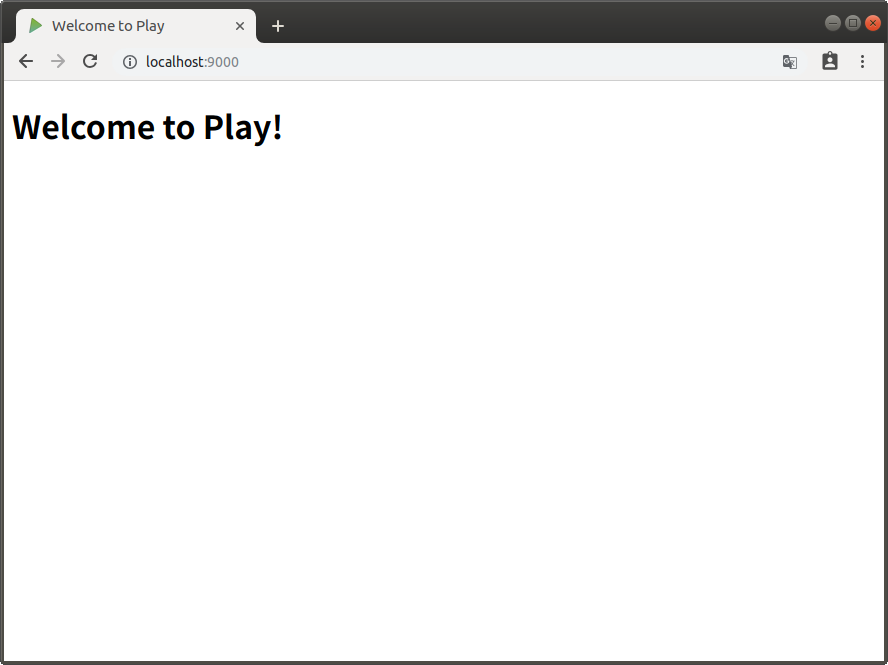

# Webアプリケーション

ScalaのWebアプリケーション・フレームワークであるPlayFrameworkを使ってみます。

## テンプレート・プロジェクトの作成

sbtのコマンドを、以下の通り実行してプロジェクトを作成します。

```bash
sbt new playframework/play-scala-seed.g8
```

最後に、以下のように、Playのプロジェクト名、組織名を尋ねられるので、名前を `hello_play` に、組織名はデフォルトのままにします。

```bash
This template generates a Play Scala project 

name [play-scala-seed]: hello_play
organization [com.example]: 
```

## Playの起動

scala-chatディレクトリにテンプレートのプロジェクトが作成されるので、ディレクトリを移動して、動かしてみます。

```bash
cd hello_play/
sbt run
```

起動したら、以下のようなメッセージが出力されます。(終了するには `Ctrl+D` を押下します。)

```bash
[info] p.c.s.AkkaHttpServer - Listening for HTTP on /0:0:0:0:0:0:0:0:9000

(Server started, use Enter to stop and go back to the console...)
```

Webブラウザを起動し、 http://localhost:9000/ のURLを入力します。以下のような画面が表示されます。


