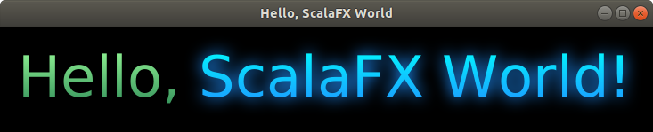

# ScalaでGUIアプリケーションを作成する

ScalaでGUIアプリケーションを作成するには、ScalaFXを使います。

まず、sbtプロジェクトを作成します。

```bash
$ sbt new sbt/scala-seed.g8
(中略)
name [Scala Seed Project]: hello_scalafx
```

build.sbtに以下を追記します。

```scala
libraryDependencies += "org.scalafx" %% "scalafx" % "8.0.144-R12"
```

追記した結果は以下のようになります。

```scala
import Dependencies._

ThisBuild / scalaVersion     := "2.12.8"
ThisBuild / version          := "0.1.0-SNAPSHOT"
ThisBuild / organization     := "com.example"
ThisBuild / organizationName := "example"

lazy val root = (project in file("."))
  .settings(
    name := "hello_scalafx",
    libraryDependencies ++= Seq(
      "org.scalafx" %% "scalafx" % "8.0.144-R12",
      scalaTest % Test
    )
  )
```

Hello.scalaファイルを以下のように編集します。

```scala
package example

import scalafx.application.JFXApp
import scalafx.application.JFXApp.PrimaryStage
import scalafx.geometry.Insets
import scalafx.scene.Scene
import scalafx.scene.effect.DropShadow
import scalafx.scene.layout.HBox
import scalafx.scene.paint.Color._
import scalafx.scene.paint.{Stops, LinearGradient}
import scalafx.scene.text.Text

object HelloScalaFXWorld extends JFXApp {

  stage = new PrimaryStage {
    title = "Hello, ScalaFX World"
    scene = new Scene {
      fill = Black
      content = new HBox {
        padding = Insets(20)
        children = Seq(
          new Text {
            text = "Hello, "
            style = "-fx-font-size: 48pt"
            fill = new LinearGradient(
              endX = 0,
              stops = Stops(PaleGreen, SeaGreen))
          },
          new Text {
            text = "ScalaFX World!"
            style = "-fx-font-size: 48pt"
            fill = new LinearGradient(
              endX = 0,
              stops = Stops(Cyan, DodgerBlue)
            )
            effect = new DropShadow {
              color = DodgerBlue
              radius = 25
              spread = 0.25
            }
          }
        )
      }
    }
  }
}
```

`sbt run` を実行すると、以下のように表示されます。


